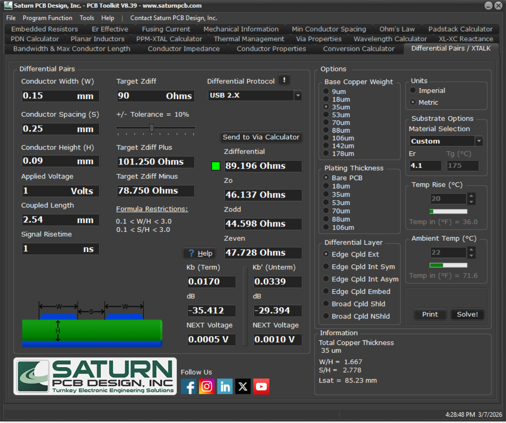
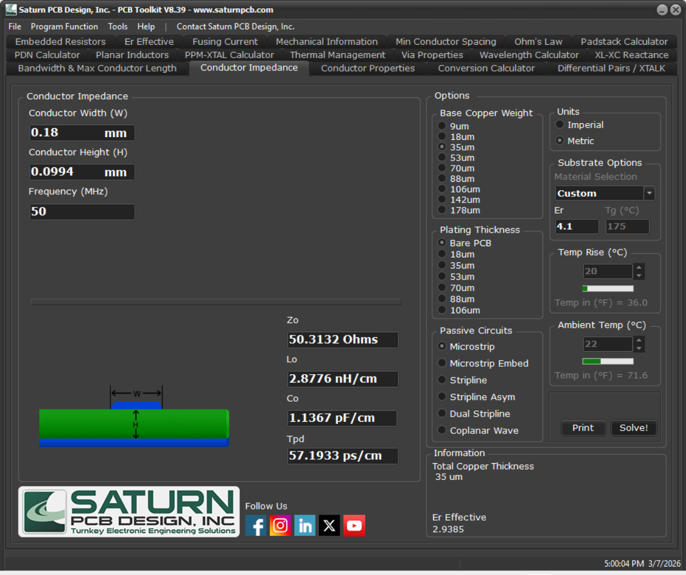

# ⚡ DRSSTC Fiber-Optic Interrupter — V1.2

<p align="left">
  
  
  
  
  
</p>

-----

## 📋 Project Summary

This repository contains the hardware design for a custom interrupter control board built for a Dual Resonant Solid State Tesla Coil (DRSSTC).

While the high-power driver is the "brain" of the system, the interrupter plays a fundamental role: it generates the PWM signal that is sent to the driver, which in turn generates the gate drive pulses to modulate the Tesla Coil's output.

Operating near a resonant RF system means dealing with significant EMI. To address this, the board relies on fiber optic transmitters to electrically isolate the control logic from the high-voltage side, alongside a controlled-impedance layout for high-speed digital interfaces and a hardware-level safety interlocking system.

Key features include:

  * **Total galvanic isolation** of the control outputs via 2 fiber optic channels, featuring a versatile dual-footprint design.
  * **Deterministic hardware safety chain** (E-brake) capable of cutting optical output power and halting MCU timers.
  * **Controlled-impedance routing** on USB, FSMC, and SDIO interfaces.
  * **Flexible power architecture** supporting USB-C bus power or an optional rechargeable battery (e.g., Samsung 30Q 3000mAh) via a dedicated charging IC and a 3.3V buck regulator.

-----


> **Status Note:** Currently, the hardware design is complete at the schematic and layout level. The board has not yet been manufactured, assembled, or tested. Building the prototype and developing the firmware (STM32CubeMX HAL + application layer) are the planned next steps.
> 
> 🔗 **Explore the design:** [View the full Schematic (PDF)](Hardware/Exports/Schematic_Interrupter_v1.2.pdf)

-----

## 🔧 Key Specifications & Features

| Parameter | Value / Detail |
|---|---|
| **MCU** | STM32F405VGT6 — ARM Cortex-M4 @ 168 MHz, LQFP-100 |
| **PCB Layers** | 4-layer controlled-impedance stackup (JLCPCB JLC04161H-3313) |
| **System Rail** | 3.3 V — generated by a synchronous buck converter |
| **Power Input** | USB-C (bus power) or Li-ion battery — Charger/Power-path: BQ24075RGT · Protection: BQ29700DSERG · Buck: TLV62569DBV |
| **Outputs** | 2x Galvanically isolated fiber optic channels (Dual-footprint: HFBR-1412TZ or IF E97) |
| **Optical Rail** | 3.3 V — Switched by a PMOS tied to the E-brake safety chain |
| **Safety Chain** | Hardware E-brake: cuts PMOS power + triggers interrupts to halt STM32 timers |
| **Display Interface** | FSMC 16-bit 8080 Mode — 50 Ω impedance-controlled. Target display: ER-TFT028A2-4 (IM3=0, IM2=0, IM1=0, IM0=1). |
| **Storage** | SD card via SDIO — 50 Ω impedance-controlled |
| **USB Interface** | Full-speed USB 2.0 — 90 Ω differential impedance |
| **Clock Source** | External 24 MHz crystal oscillator |
| **User Interface** | Rotary encoders + tactile push buttons |
| **External/Debug** | UART header (with 100 Ω series resistors) for debug or BT modules + Tag-Connect SWD |
| **Length Matching** | Applied on USB D+/D−, FSMC data/address bus, and SDIO data lines |
| **Design Tool** | KiCad 9.0 |

-----

## 🏆 Hardware Engineering Highlights

This section details some of the specific design choices made during the layout routing and stackup definition.

### 📡 Signal Integrity

  * **USB 2.0 (Full Speed):** The D+/D− pair is routed as a 90 Ω differential pair, calculated using the Saturn PCB Toolkit. Intra-pair skew is minimized across the routing path.
  * **FSMC & SDIO:** Routed at 50 Ω characteristic single-ended impedance. For the SDIO protocol, 33 Ω series termination resistors were placed as close as possible to the MCU source to suppress reflections.
  * **UART / External Header:** 100 Ω series resistors were added to the TX/RX lines near the connector. Since no TVS diodes were implemented at the silicon level for this header, these resistors provide a basic level of protection against spikes during manual probing or module connection.

| USB 2.0 (90 Ω Differential Target) | FSMC & SDIO (50 Ω Single-Ended Target) |
| :---: | :---: |
|  |  |

### 🧱 Stackup & Routing Strategy

  * **4-Layer Stackup:** Configured as `Signal+PWR` / `GND` / `GND` / `Signal+PWR`.
  * **Return Paths:** Layers 2 and 3 provide solid, unbroken ground reference planes for the high-speed routing on the top and bottom layers.
  * **Layer Transitions:** Whenever a high-speed signal transitions from Layer 1 to Layer 4, adjacent GND stitching vias were placed next to the signal via to ensure an uninterrupted return current path between the two ground planes.

-----

## 🔒 Safety Architecture

  * **Galvanic Isolation & Transmitter Flexibility:** The commands sent to the driver leave the board exclusively through the fiber optic transmitters. This prevents ground loops and high-voltage transients from traveling back into the control board logic. To maximize flexibility, each of the two optical channels features a dual-footprint design. You can independently populate either an **HFBR-1412TZ** or an **IF E97** transmitter per channel. The onboard current-limiting resistors are specifically calculated and routed for these two standard components.
  * **Hardware E-brake Mechanism:**
      * The E-brake switch is normally closed (NC) to GND. When pressed — or if the cable is accidentally disconnected — a pull-up resistor drives the PMOS gate to 3.3 V, switching it off. This ensures the system fails safe on cable break, not just on deliberate actuation.
      * **Action 1 (Hardware):** Pressing the E-brake disconnects the GND path. This immediately switches off a PMOS on the 3.3V optical rail, physically de-energizing the fiber transmitters and guaranteeing zero output, completely independent of the microcontroller's state.
      * **Action 2 (MCU IRQ):** The same physical event asserts a hardware interrupt on the STM32, halting the PWM timers in the fastest possible IRQ context.
      * **Action 3 (Software IRQ):** A software-level handler serves as a secondary redundant stop mechanism.

-----

## 📁 Repository Structure

```text
DRSSTC-Interrupter/
│
├── Hardware/
│   ├── KiCad/
│   │   ├── Interrupter/              ← KiCad project files
│   │   └── Libraries/                ← Additional libraries
│   └── Exports/
│       ├── Schematic_Interrupter_v1.2.pdf
│       └── PCB_v1.2.png
│
├── Fabrication/
│   ├── Gerbers/
│   ├── BOM_Interrupter_v1.2.csv
│   └── InteractiveBOM.html
│
├── Docs/
│   ├── Impedance_Calculations/
│   │   ├── USB_90ohm_Differential.png
│   │   └── FSMC_SDIO_50ohm_SingleEnded.png
│   └── Stackup/
│       └── JLCPCB_Stackup_Reference.png
│
├── Firmware/
│   └── STM32CubeMX/
│       └── Interrupter.ioc           ← Peripheral configuration (WIP)
│
└── README.md
```

-----

## 🛠️ Tools Used

| Tool | Version | Purpose |
|---|---|---|
| **KiCad EDA** | 9.0 | Full schematic capture and 4-layer PCB layout |
| **STM32CubeMX** | 6.16.0 | MCU peripheral configuration, clock tree, HAL code generation *(WIP)* |
| **Saturn PCB Toolkit** | 8.39 | Controlled impedance calculation (90 Ω differential and 50 Ω single-ended) |

-----

## ⚠️ Disclaimer

This project outlines a control board intended for use with high-voltage equipment capable of generating potentially lethal electrical discharges. All hardware documentation in this repository is provided **for educational and portfolio purposes only**. The author assumes no liability for any damage, injury, or loss resulting from the use or misuse of this material.

-----

## 👤 Author

**Alberto Marrone**
MSc Student in Electronics Engineering — Politecnico di Milano
